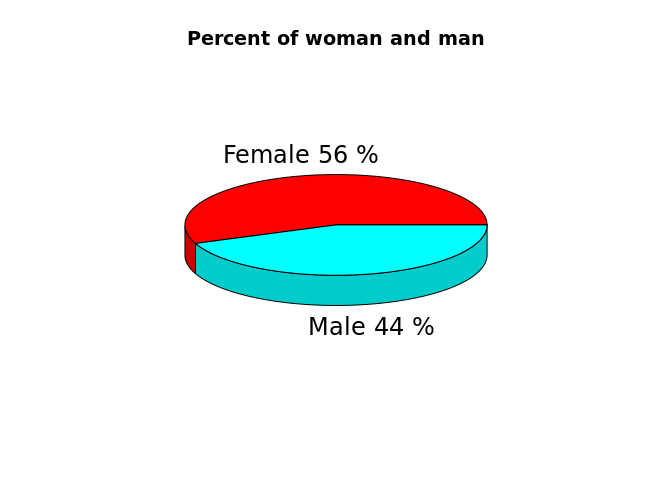
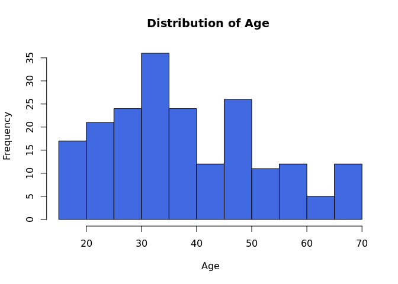
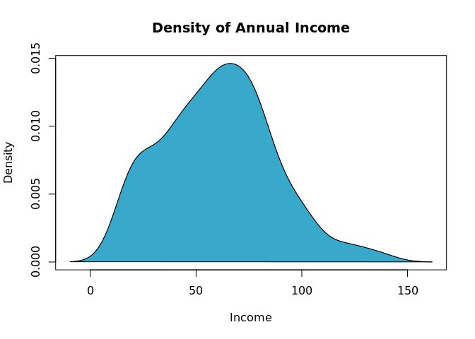
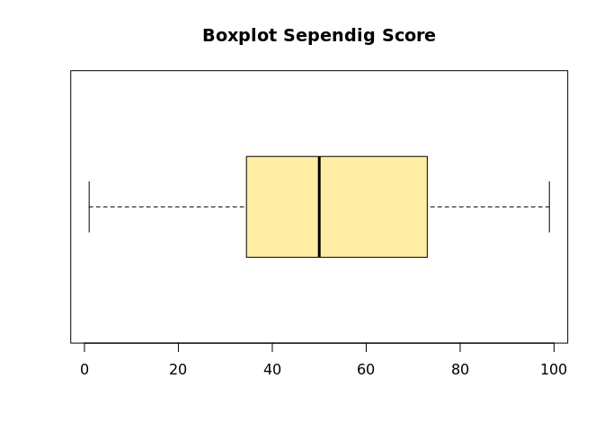
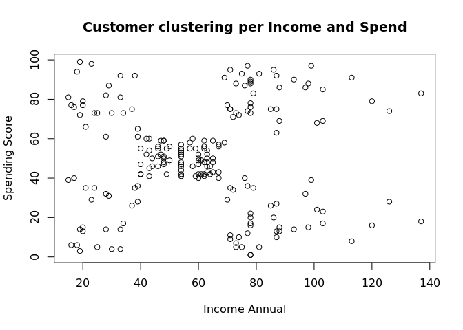
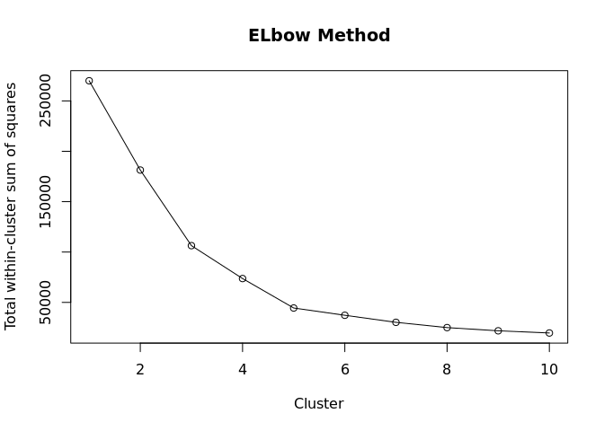
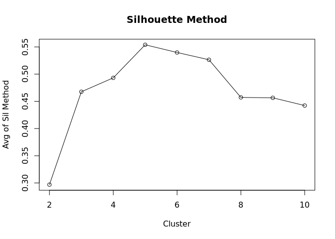
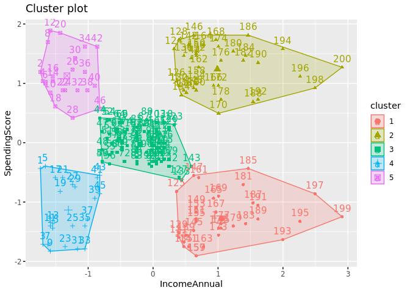

<!-- README.md is generated from README.Rmd. Please edit that file -->

# Customer-segmentation

<!-- badges: start -->
<!-- badges: end -->

The goal of Customer Segmentation is to chose the best categorization in
a graph Spend vs Income with the objective of know what kind of customer
offer the right product, always searching a buy.

------------------------------------------------------------------------

## Importation and exploration of data

Let’s look at the dataset to see if it has been loaded correctly and to
see the name and type of the variables.

    #>   CustomerID Gender Age Annual.Income..k.. Spending.Score..1.100.
    #> 1          1   Male  19                 15                     39
    #> 2          2   Male  21                 15                     81
    #> 3          3 Female  20                 16                      6
    #> 4          4 Female  23                 16                     77
    #> 5          5 Female  31                 17                     40
    #> 6          6 Female  22                 17                     76

We look at the summary of the data and the standard deviation of numeric
variables.

    #>    CustomerID        Gender               Age        Annual.Income..k..
    #>  Min.   :  1.00   Length:200         Min.   :18.00   Min.   : 15.00    
    #>  1st Qu.: 50.75   Class :character   1st Qu.:28.75   1st Qu.: 41.50    
    #>  Median :100.50   Mode  :character   Median :36.00   Median : 61.50    
    #>  Mean   :100.50                      Mean   :38.85   Mean   : 60.56    
    #>  3rd Qu.:150.25                      3rd Qu.:49.00   3rd Qu.: 78.00    
    #>  Max.   :200.00                      Max.   :70.00   Max.   :137.00    
    #>  Spending.Score..1.100.
    #>  Min.   : 1.00         
    #>  1st Qu.:34.75         
    #>  Median :50.00         
    #>  Mean   :50.20         
    #>  3rd Qu.:73.00         
    #>  Max.   :99.00

    #> [1] "The standar deviation or the volatility of Age is:  13.9690073315589"
    #> [1] "The standar deviation or the volatility of Annual Income is:  26.2647211652712"
    #> [1] "The standar deviation or the volatility of Spending Score is: 25.8235216683702"

The set of these data can tell us the distribution of each variable,
knowing the quartiles, the mean and the standard deviation.

------------------------------------------------------------------------

## Data visualitation.

We are going to draw some graphs that will help us to better understand
the data, we will make some graphs such as histograms, boxplots, bar
charts among others, this will be a complement to the exploration of the
data.

#### Data visualitation per Age

<!-- -->

#### Data visualitation per Age

<!-- -->

#### Data visualitation per Annual Income

<!-- -->

#### Data visualitation per Annual Income

<!-- -->

------------------------------------------------------------------------

## K-means algorithm

Since we want to segment a very diverse group of customers based on
their main characteristics (dataset variables) it may be appropriate to
use the k-means algorithm to do the clustering. To find out the optimal
number of custers, the Elbow Method and the Silhouette Method will be
used.

First, let’s look at the dataset in a graph SpendingScore vs
IncomeAnnual, because We want to know how many spend the customers to
offer our best product according their needs.

<!-- -->

Once knowing how the graph looks like, We can apply the k-means method,
but in this case, We going to do a loop running 10 times for 10
different k values of the clustering, obtaining 10 different values for
total within-cluster sum of squares, with that values save in array, We
can now make a plot, finding the the minimum of total within-cluster sum
of squares finding in turn best cluster.

-   Elbow Method

<!-- -->

    #>  [1] 269981.28 181363.60 106348.37  73679.79  44448.46  37233.81  30227.61
    #>  [8]  25004.37  21826.94  19653.38

<!-- -->

-   Silhouette Method

Silhouette analysis can be used to study the separation distance between
the resulting clusters. The silhouette plot displays a measure of how
close each point in one cluster is to points in the neighboring clusters
and thus provides a way to assess parameters like number of clusters
visually. This measure has a range of \[-1, 1\].

In the same way, we will run 9 times in a loop to know the silhouette
value of each K clusters. So we will make a graph of average silhouette
method vs Cluster, as follows:

<!-- -->

By observing where the concavity in the Elbow Method is at the same time
as the maximum average of the Silhouette method, we decide that the
optimal number of clusters is 5. Finally, let’s identify each cluster
with a colour, giving us the following result:

<!-- -->
